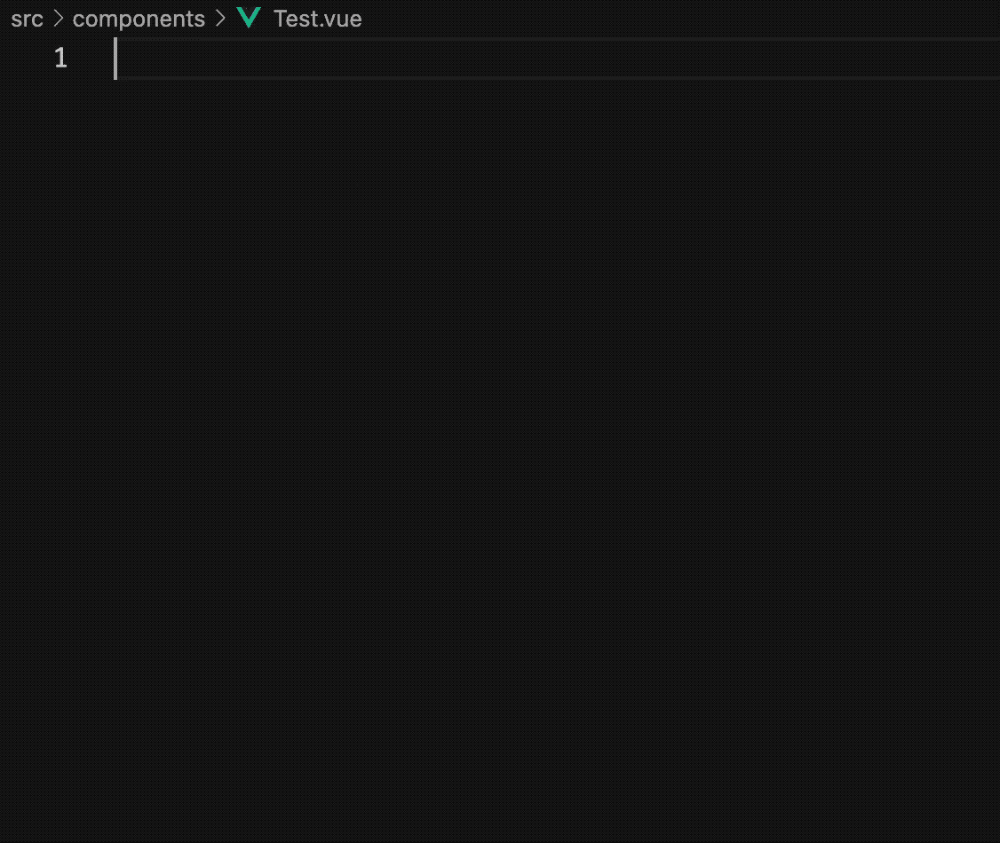

# memi-quasar-snippets

"quasar-snippets" was not updated, so I made it myself.

## Usages



> eg) qinit -> ref -> (tab) -> const message = ref('hello') -> (tab) -> (esc x 2) -> qcard-default -> {{ message }}

## Features

- {componentName}-default: by "node_modules/quasar/components/{componentName}.json"
- {componentName}-example: by "[quasar-snippets](https://marketplace.visualstudio.com/items?itemName=abdelaziz18003.quasar-snippets)"

## Example

**qinit**
```html
<script setup lang="ts">
import { } from 'vue'

</script>
<template>
  
</template>
```

**qpage-default**
```html
<q-page
  :padding="false"
  :style-fn="null"
>
  content
</q-page>
```
**qpage-example**
```html
<q-page :style-fn="myTweak" padding></q-page>
```
## Requirements
- quasar 2.1

## Known Issues

## Link

made by [https://memi.dev](https://memi.dev)